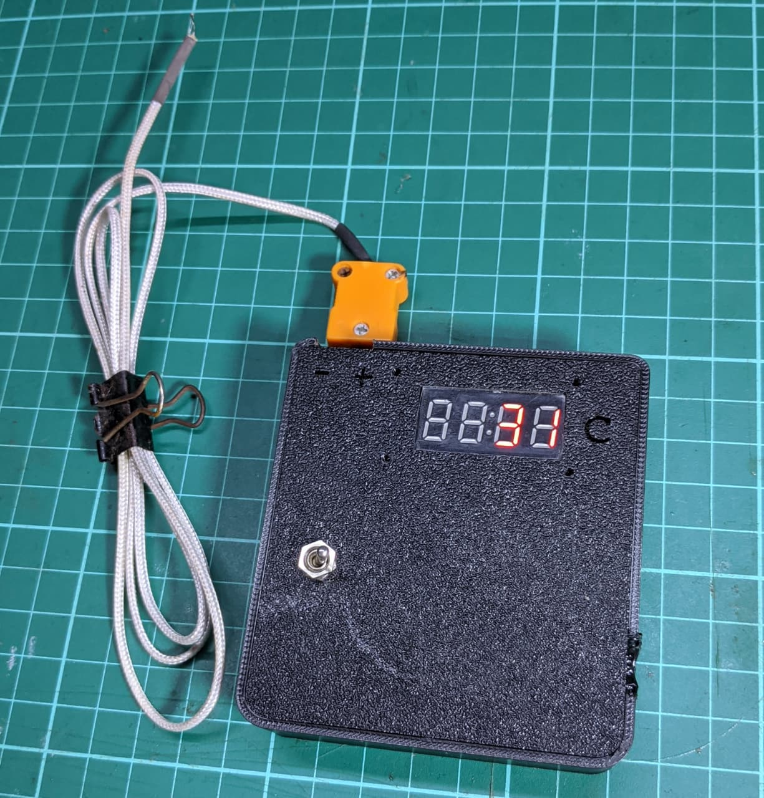
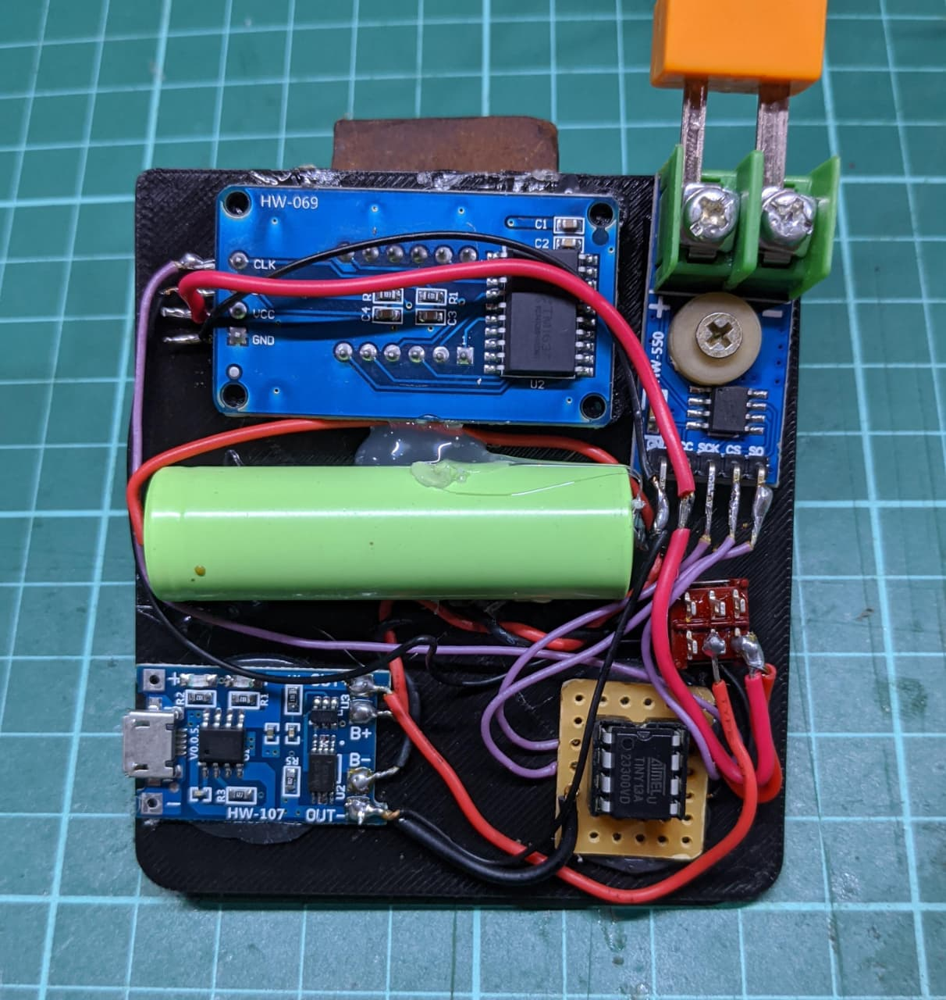
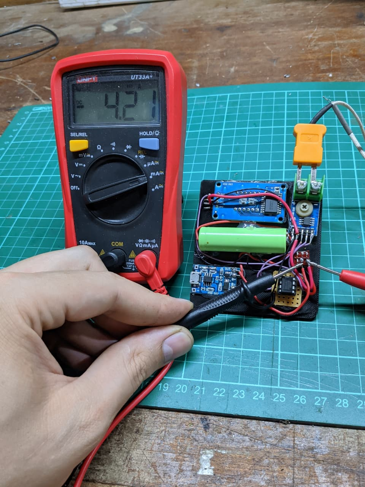

# Termómetro Digital con ATtiny13A, MAX6675 y TM1637

Este proyecto implementa un termómetro digital de alta temperatura utilizando un microcontrolador ATtiny13A (o compatible), un módulo de termopar MAX6675 y un display de 7 segmentos controlado por el driver TM1637.

## Descripción

El programa lee la temperatura ambiente a través del sensor MAX6675 y la muestra en tiempo real en un display de 4 dígitos. Está diseñado para ser compacto y eficiente, ideal para aplicaciones donde el espacio y el consumo son críticos.

## Hardware Requerido

*   **Microcontrolador**: ATtiny13A (Probado) o cualquier microcontrolador de la familia ATtiny compatible.
*   **Sensor de Temperatura**: Módulo MAX6675 con termopar tipo K.
*   **Visualización**: Display de 7 segmentos con controlador TM1637.
*   **Fuente de Alimentación**: fuente de 3.3v a 5V (probado con baterias Litio).

## Multimedia

*Haz clic en la imagen para ver el video en YouTube*

### Circuito y Medición
| Circuito | Medición de Corriente | Prueba Messi |
| :---: | :---: | :---: |
|  |  |  |

## Consumo de Energía

El consumo de corriente varía según la temperatura mostrada (cantidad de dígitos encendidos):

*   **T < 100°C** (2 dígitos): ~4.2mA
*   **T > 100°C** (3 dígitos): ~6.3mA
*   **T > 1000°C** (4 dígitos): ~8.4mA

## Conexiones

### MAX6675
| Pin MAX6675 | Pin Arduino (Código) | Pin Físico ATtiny13A |
| :--- | :--- | :--- |
| SCK | 3 | Pin 2 (PB3) |
| SO | 4 | Pin 3 (PB4) |
| CS | 2 | Pin 7 (PB2) |
| VCC | - | VCC (Pin 8) |
| GND | - | GND (Pin 4) |

### TM1637
La configuración de pines para el display TM1637 se encuentra definida en la librería `tm1637.h`. Por defecto en la librería utilizada (`github.com/lpodkalicki/attiny-tm1637-library`):

| Pin TM1637 | Pin Físico ATtiny13A | Definición en Librería |
| :--- | :--- | :--- |
| CLK | Pin 6 (PB1) | `TM1637_CLK_PIN` |
| DIO | Pin 5 (PB0) | `TM1637_DIO_PIN` |
| VCC | VCC (Pin 8) | - |
| GND | GND (Pin 4) | - |

*Nota: Estos pines pueden modificarse editando el archivo `tm1637.h` si es necesario.*

## Dependencias

*   **Librería TM1637**: El proyecto requiere una librería para manejar el display TM1637. Asegúrate de tener el archivo `tm1637.h` en el directorio del proyecto o instalada en tu entorno Arduino.

## Compilación y Carga

1.  Abre el archivo `ATINY_TM1637_MAX6675.ino` en el IDE de Arduino.
2.  Asegúrate de tener instalado el soporte para ATtiny (por ejemplo, usando [MicroCore](https://github.com/MCUdude/MicroCore) para ATtiny13).
3.  Selecciona la placa **ATtiny13** y la frecuencia de reloj adecuada (ej. 9.6 MHz interno o 1.2 MHz, verificar timing si es crítico).
4.  Compila y sube el código utilizando un programador ISP (como Arduino as ISP o USBasp).

## Diseños 3D

Se incluyen los archivos necesarios para la fabricación de la carcasa:

### Archivos de Fabricación (STEP)
*   [Caja Inferior](3d-pieces/caja%20inferior.step)
*   [Caja Termómetro](3d-pieces/caja%20termometro%205.step)

### Archivos Editables (FreeCAD V1.1)
*   [Caja Inferior (Editable)](3d-pieces/caja%20inferior.20251208-170326.FCBak)
*   [Caja Termómetro (Editable)](3d-pieces/caja%20termometro.20251208-155530.FCBak)

## Autor

*   **Nicolas Pacheco** 
    *   [Github](https://github.com/nicopache97)
    *   [Linkedin](https://www.linkedin.com/in/nico-pacheco/)
    *   [Mail](mailto:nicopacheco1997@gmail.com)

## Versión

*   Rev 1.0a | 19 Dic 2025

## Demo

